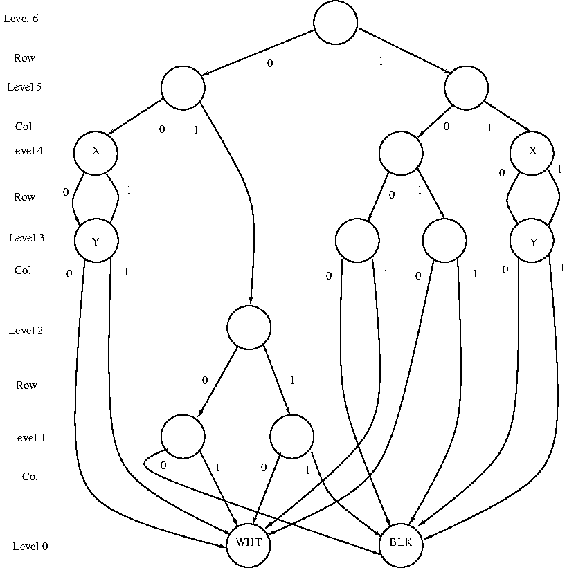

# Homework 1 - CSE 320 - Spring 2021
#### Professor Eugene Stark

### **Due Date: Friday 02/26/2021 @ 11:59pm**

**Read the entire doc before you start**

## Introduction

In this assignment, you will write a command line utility
(called `birp`, for *Binary decision diagram Image RePresentation*)
to convert image data between the PGM ("Portable Gray Map") format and a
a non-standard `birp` format that represents the pixel rasters using a
variant of a data structure called *binary decision diagrams* (BDDs)
(see, e.g., [https://en.wikipedia.org/wiki/Binary_decision_diagram](https://en.wikipedia.org/wiki/Binary_decision_diagram)).
You will also implement some simple transformations on images represented
using BDDs.
The goal of this homework is to familiarize yourself with C programming,
with a focus on input/output, bitwise manipulations, and the use of pointers.

For all assignments in this course, you **MUST NOT** put any of the functions
that you write into the `main.c` file.  The file `main.c` **MUST ONLY** contain
`#include`s, local `#define`s and the `main` function (you may of course modify
the `main` function body).  The reason for this restriction has to do with our
use of the Criterion library to test your code.
Beyond this, you may have as many or as few additional `.c` files in the `src`
directory as you wish.  Also, you may declare as many or as few headers as you wish.
Note, however, that header and `.c` files distributed with the assignment base code
often contain a comment at the beginning which states that they are not to be
modified.  **PLEASE** take note of these comments and do not modify any such files,
as they will be replaced by the original versions during grading.

> :scream: Array indexing (**'A[]'**) is not allowed in this assignment. You
> **MUST USE** pointer arithmetic instead. All necessary arrays are declared in
> the `const.h` header file. You **MUST USE** these arrays. **DO NOT** create
> your own arrays. We **WILL** check for this.

> :nerd: Reference for pointers: [https://beej.us/guide/bgc/html/multi/pointers.html](https://beej.us/guide/bgc/html/multi/pointers.html).

# Getting Started

Fetch base code for `hw1` as described in `hw0`. You can find it at this link:
[https://gitlab02.cs.stonybrook.edu/cse320/hw1](https://gitlab02.cs.stonybrook.edu/cse320/hw1).
**IMPORTANT: 'FETCH', DO NOT 'CLONE'.**

Both repos will probably have a file named `.gitlab-ci.yml` with different contents.
Simply merging these files will cause a merge conflict. To avoid this, we will
merge the repos using a flag so that the `.gitlab-ci.yml` found in the `hw1`
repo will replace the `hw0` version.  To merge, use this command:

```
git merge -m "Merging HW1_CODE" HW1_CODE/master --strategy-option=theirs
```

> :scream: Based on past experience, many students will either ignore the above command or forget
> to use it.  The result will be a **merge conflict**, which will be reported by git.
> Once a merge conflict has been reported, it is essential to correct it before committing
> (or to abort the merge without committing -- use `git merge --abort` and go back and try again),
> because git will have inserted markers into the files involved indicating the locations of the
> conflicts, and if you ignore this and commit anyway, you will end up with corrupted files.
> You should consider it important to read up at an early stage on merge conflicts with git and
> how to resolve them properly.

Here is the structure of the base code:

<pre>
.
├── .gitlab-ci.yml
└── hw1
    ├── .gitignore
    ├── hw1.sublime-project
    ├── include
    │   ├── bdd.h
    │   ├── birp.h
    │   ├── const.h
    │   ├── debug.h
    │   └── image.h
    ├── Makefile
    ├── rsrc
    │   ├── checker.asc
    │   ├── checker.birp
    │   ├── checker.pgm
    │   ├── cour25.asc
    │   ├── cour25.birp
    │   ├── cour25.pgm
    │   ├── M.asc
    │   ├── M.birp
    │   ├── M.pgm
    │   ├── stone.asc
    │   ├── stone.birp
    │   └── stone.pgm
    ├── src
    │   ├── bdd.c
    │   ├── birp.c
    │   ├── image.c
    │   └── main.c
    ├── test_output
    │   ├── .git_keep
    └── tests
        └── hw1_tests.c
</pre>

- The `.gitlab-ci.yml` file is a file that specifies "continuous integration" testing
to be performed by the GitLab server each time you push a commit.  Usually it will
be configured to check that your code builds and runs, and that any provided unit tests
are passed.  You are free to change this file if you like.

> :scream:  The CI testing is for your own information; it does not directly have
> anything to do with assignment grading or whether your commit has been properly
> pushed to the server.  If some part of the testing fails, you will see the somewhat
> misleading message "commit failed" on the GitLab web interface.
> This does not mean that "your attempt to commit has failed" or that "your commit
> didn't get pushed to the server"; the very fact that the testing was triggered at
> all means that you successfully pushed a commit.  Rather, it means that "the CI tests
> performed on a commit that you pushed did not succeed".  The purpose of the tests are
> to alert you to possible problems with your code; if you see that testing has failed
> it is worth investigating why that has happened.  However, the tests can sometimes
> fail for reasons that are not your fault; for example, the entire CI "runner" system
> may fail if someone submits code that fills up the system disk.  You should definitely
> try to understand why the tests have failed if they do, but it is not necessary to be
> overly obsessive about them.

- The `hw1.sublime-project` file is a "project file" for use by the Sublime Text editor.
It is included to try to help Sublime understand the organization of the project so that
it can properly identify errors as you edit your code.

- The `Makefile` is a configuration file for the `make` build utility, which is what
you should use to compile your code.  In brief, `make` or `make all` will compile
anything that needs to be, `make debug` does the same except that it compiles the code
with options suitable for debugging, and `make clean` removes files that resulted from
a previous compilation.  These "targets" can be combined; for example, you would use
`make clean debug` to ensure a complete clean and rebuild of everything for debugging.

- The `include` directory contains C header files (with extension `.h`) that are used
by the code.  Note that these files often contain `DO NOT MODIFY` instructions at the beginning.
You should observe these notices carefully where they appear.

- The `src` directory contains C source files (with extension `.c`).

- The `tests` directory contains C source code (and sometimes headers and other files)
that are used by the Criterion tests.

- The `rsrc` directory contains some samples of image files that you can use for
testing purposes.

 - The `test_output` directory is a scratch directory where the Criterion tests can
put output files.  You should not commit any files in this directory to your
`git` repository.

## A Note about Program Output

What a program does and does not print is VERY important.
In the UNIX world stringing together programs with piping and scripting is
commonplace. Although combining programs in this way is extremely powerful, it
means that each program must not print extraneous output. For example, you would
expect `ls` to output a list of files in a directory and nothing else.
Similarly, your program must follow the specifications for normal operation.
One part of our grading of this assignment will be to check whether your program
produces EXACTLY the specified output.  If your program produces output that deviates
from the specifications, even in a minor way, or if it produces extraneous output
that was not part of the specifications, it will adversely impact your grade
in a significant way, so pay close attention.

**Use the debug macro `debug` (described in the 320 reference document in the
Piazza resources section) for any other program output or messages you many need
while coding (e.g. debugging output).**

# Part 1: Program Operation and Argument Validation

In this part, you will write a function to validate the arguments passed to your
program via the command line. Your program will treat arguments as follows:

- If no flags are provided, you will display the usage and return with an
`EXIT_FAILURE` return code

- If the `-h` flag is provided, you will display the usage for the program and
  exit with an `EXIT_SUCCESS` return code.

- If the `-i` flag is provided, it will be followed by a token that describes
  the type of input that the program will expect.  The possibilities are:
  `pgm` (for PGM format) and `birp` (for BIRP format).  If the `-i` flag is
  not provided, the default of `birp` is assumed.

- If the `-o` flag is provided, it will be followed by a token that describes
  the type of output that the program will produce.  The possibilities are:
  `pgm` (for PGM format), `birp` (for BIRP format), and `ascii` for
  ("ASCII art" format).  If the `-o` flag is not provided, the default of
  `birp` is assumed.
  
- In case the input and output formats are both `birp`, then some additional
  arguments may occur, which determine a transformation to be performed.
  These are as follows:
  
  - `-n` (for "negative") -- The value of each pixel is complemented, transforming
	between a "positive" and "negative" image.
  
  - `-t` (for "threshold") -- This flag is followed by an integer value
	in the range [0, 255].  Each pixel in the input image is compared with the
	threshold -- if it is at least as great as the threshold it is replaced by
	the value `255` (representing white); otherwise it is replaced by the
	value `0` (representing black).

  - `-r` (for "rotate") -- The image is rotated counterclockwise by 90 degrees,
	in a way that is described in more detail below.

  - `-z` (for "zoom out") -- This flag is followed by an integer "zoom factor" k,
     in the range [0, 16].  The row and column dimensions of the image raster
	 are each decreased by a factor of 2<sup>k</sup>, in a way that is discussed
	 in more detail below.

  - `-Z` (for "zoom in") -- This flag is followed by an integer "zoom factor" k,
     in the range [0, 16].  The row and column dimensions of the image raster
	 are each increased by a factor of 2<sup>k</sup>, in a way that is discussed
	 in more detail below.

In all cases, the program reads image data from `stdin` and writes image data
to `stdout`.  Any other printout, such as diagnostic messages produced by the
program, are written to `stderr`.  If the program runs without error, then it
will exit with the `EXIT_SUCCESS` status code; if any error occurs during the
execution of the program, then it will exit with the `EXIT_FAILURE` status code.

> :nerd: `EXIT_SUCCESS` and `EXIT_FAILURE` are macros defined in `<stdlib.h>` which
> represent success and failure return codes respectively.

> :nerd: `stdin`, `stdout`, and `stderr` are special I/O "streams", defined
> in `<stdio.h>`, which are automatically opened at the start of execution
> for all programs, do not need to be reopened, and (almost always) should not
> be closed.

The usage scenarios for this program are described by the following message,
which is printed by the program when it is invoked without any arguments:

<pre>
USAGE: bin/birp [-h] [-i FORMAT] [-o FORMAT] [-n|-r|-t THRESHOLD|-z FACTOR|-Z FACTOR]
   -h       Help: displays this help menu.
   -i       Input format: `pgm` or `birp` (default `birp`)
   -o       Output format: `pgm`, `birp`, or `ascii` (default `birp`)

In all cases, the program reads image data from the standard input and writes image
data to the standard output.  If the input and output formats are both `birp`,
then one of the following transformations may be specified (the default is an
identity transformation; *i.e.* the image is passed unchanged):
   -n       Complement each pixel value
   -r       Rotate the image 90-degrees counterclockwise
   -t       Apply a threshold filter (with THRESHOLD in [0, 255]) to the image
   -z       Zoom out (by FACTOR in [0, 16]), producing a smaller raster
   -Z       Zoom in, (by FACTOR in [0, 16]), producing a larger raster
</pre>

The square brackets indicate that the enclosed argument is optional.
The `-n|-r|-t THRESHOLD|-z FACTOR|-Z FACTOR` means that one of
`-n`, `-r`, `-t THRESHOLD`, `-z FACTOR`, or `-Z FACTOR` may be specified.
If `-t` is present, then it is immediately followed by a parameter `THRESHOLD`.
Similarly, if `-z` or `-Z` is present, then it is immediately followed by
a parameter `FACTOR`.

A valid invocation of the program implies that the following hold about
the command-line arguments:

- All "positional arguments" (`-h`, `-i`, or `-o`) come before any optional arguments
(`-n`, `-r`, `-t`, `-z`, or `-Z`).
The optional arguments may come in any order after the positional ones.

- If the `-h` flag is provided, it is the first positional argument after
the program name and any other arguments that follow are ignored.

- If the `-h` flag is *not* specified, then one or both of `-i` or `-o`
may be specified, in either order.

- If an option requires a parameter, the corresponding parameter must be provided
(*e.g.* `-t` must always be followed by a THRESHOLD specification).

    - If `-t` is given, the THRESHOLD argument must be a non-negative integer
    in the range `[0, 255]`.

    - If `-z` or `-Z` is given, the FACTOR argument must be a non-negative integer
    in the range `[0, 16]`.

- The options `-n`, `-r`, `-t`, `-z`, or `-Z` may only be given if any
  `-i` or `-o` option that may be present specifies `birp` image format.

For example, the following are a subset of the possible valid argument
combinations:

- `$ bin/birp -h ...`
- `$ bin/birp -i pgm -o ascii`
- `$ bin/birp -Z 1`

> :scream: The `...` means that all arguments, if any, are to be ignored; e.g.
> the usage `bin/birp -h -x -y BLAHBLAHBLAH -z` is equivalent to `bin/birp -h`.

Some examples of invalid combinations would be:

- `$ bin/birp -i pgm -r`
- `$ bin/birp -n -t 100`
- `$ bin/birp -i ascii -o pgm`
- `$ bin/birp -z 20`

> :scream: You may use only "raw" `argc` and `argv` for argument parsing and
> validation. Using any libraries that parse command line arguments (e.g.
> `getopt`) is prohibited.

> :scream: Any libraries that help you parse strings are prohibited as well
> (`string.h`, `ctype.h`, etc).  The use of `atoi`, `scanf`, `fscanf`, `sscanf`,
> and similar functions is likewise prohibited.  *This is intentional and
> will help you practice parsing strings and manipulating pointers.*

> :scream: You **MAY NOT** use dynamic memory allocation in this assignment
> (i.e. `malloc`, `realloc`, `calloc`, `mmap`, etc.).

> :nerd: Reference for command line arguments: [https://beej.us/guide/bgc/html/multi/morestuff.html#clargs](https://beej.us/guide/bgc/html/multi/morestuff.html#clargs).

**NOTE:** The `make` command compiles the `birp` executable into the `bin` folder.
All commands from here on are assumed to be run from the `hw1` directory.

### **Required** Validate Arguments Function

In `const.h`, you will find the following function prototype (function
declaration) already declared for you. You **MUST** implement this function
as part of the assignment.

```c
int validargs(int argc, char **argv);
```

The file `birp.c` contains the following specification of the required behavior
of this function:

```c
/**
 * @brief Validates command line arguments passed to the program.
 * @details This function will validate all the arguments passed to the
 * program, returning 0 if validation succeeds and -1 if validation fails.
 * Upon successful return, the various options that were specifed will be
 * encoded in the global variable 'global_options', where it will be
 * accessible elsewhere int the program.  For details of the required
 * encoding, see the assignment handout.
 *
 * @param argc The number of arguments passed to the program from the CLI.
 * @param argv The argument strings passed to the program from the CLI.
 * @return 0 if validation succeeds and -1 if validation fails.
 * @modifies global variable "global_options" to contain an encoded representation
 * of the selected program options.
 */
```

> :scream: This function must be implemented as specified as it will be tested
> and graded independently. **It should always return -- the USAGE macro should
> never be called from validargs.**

The `validargs` function should return -1 if there is any form of failure.
This includes, but is not limited to:

- Invalid number of arguments (too few or too many).

- Invalid ordering of arguments.

- A missing parameter to an option that requires one (e.g. `-t` with no
  `THRESHOLD` specification).

- Invalid parameter.  A `FORMAT` specified with `-i` is invalid if it
  not one of `pgm` or `birp`.  A `FORMAT` specified with `-o` is invalid
  if it is not one of `pgm`, `birp`, or `ascii`.  A numeric parameter
  specfied with `-t`, `-z`, or `-Z` is invalid if it contains characters
  other than the digits ('0'-'9'), or if it denotes a value outside of the
  specified range ([0, 255] for `THRESHOLD`, [0, 16] for `FACTOR`).

The `global_options` variable of type `int` is used to record the mode
of operation (i.e. help/generate/detect) of the program.
 This is done as follows:

- If the `-h` flag is specified, the most significant bit (bit 31) is 1.

- The specified input format is encoded in the four least-significant bits
  (bits 0 - 3) according to the following scheme: 0x1 means `pgm`
  and 0x2 means `birp`.  Value 0x0 is not permitted.


- The specified output format is encoded in bits (4 - 7) according to the
  following scheme: 0x1 means `pgm`, 0x2 means `birp`, and 0x3 means `ascii`.
  Value 0x0 is not permitted.

- A specified transformation is encoded in bits (8 - 11) according to the
  following scheme: 0x0 means the identity transformation (i.e. no transformation),
  0x1 means "negative" (`-n`), 0x2 means "threshold" (`-t`),
  0x3 means "zoom" (`-z` or `-Z`) and 0x4 means "rotate" (`-r`).
  
- Any parameter to a specified transformation is encoded as an 8-bit signed
  (*i.e.* twos complement) integer in bits (16 - 23).  A `THRESHOLD` parameter
  will be a positive value.  A `FACTOR` parameter is negative for zoom out (`-z`)
  and positive for zoom on (`-Z`).

If `validargs` returns -1 indicating failure, your program must call
`USAGE(program_name, return_code)` and return `EXIT_FAILURE`.
**Once again, `validargs` must always return, and therefore it must not
call the `USAGE(program_name, return_code)` macro itself.
That should be done in `main`.**

If `validargs` sets the most-significant bit of `global_options` to 1
(i.e. the `-h` flag was passed), your program must call `USAGE(program_name, return_code)`
and return `EXIT_SUCCESS`.

> :nerd: The `USAGE(program_name, return_code)` macro is already defined for you
> in `const.h`.

If validargs returns 0, then your program must read input data from `stdin`
and write output data to `stdout`.
Upon successful completion, your program should exit with exit status `EXIT_SUCCESS`;
otherwise, in case of an error it should exit with exit status `EXIT_FAILURE`.

> :nerd: Remember `EXIT_SUCCESS` and `EXIT_FAILURE` are defined in `<stdlib.h>`.
> Also note, `EXIT_SUCCESS` is 0 and `EXIT_FAILURE` is 1.

### Example validargs Executions

The following are examples of the setting of `global_options` and the
other global variables for various command-line inputs.
Each input is a bash command that can be used to invoke the program.

- **Input:** `bin/birp -h`.  **Setting:** `global_options=0x80000000`
(`help` bit is set, other bits clear).

- **Input:** `bin/birp -i pgm `.  **Setting:** `global_options=0x21`
(input type is 0x1, output type is 0x2).

- **Input:** `bin/birp -i birp -o ascii `.  **Setting:** `global_options=0x32`
(input type is 0x2, output type is 0x3).

- **Input:** `bin/birp -z 2 `.  **Setting:** `global_options=0xfe0322`
(input type is 0x2, output type is 0x2, transform is 0x03, `FACTOR` is 0xfe;
*i.e* -2 in 8-bit twos complement encoding).

- **Input:** `bin/birp -n -i birp`.  **Setting:** `global_options=0x0`.
This is an error case because the specified argument ordering is invalid
(`-n` is before `-i`). In this case `validargs` returns -1, leaving `global_options`
and the other options variables unset.

# Part 2: Digital Images and PGM Format

The purpose of this section is to provide you with some very basic
knowledge of how images are represented in digital form.
An image is represented digitally as a two-dimensional array of *pixels*,
where each pixel corresponds to a small region of a continuous image.
Each pixel is assigned a discrete value that represents information about
image in the corresponding region.
For a simple grayscale representation, each pixel might be assigned an
nonnegative integer value of a fixed number of bits, which simply
represents the brightness of the image in the corresponding region.
For color representations, each pixel might be assigned a tuple of
integers that give the brightness levels of several constituent colors.
For example, one common scheme is "24-bit RGB", where each pixel is
assigned a triple of 8-bit values, which represent the intensities of
red, green, and blue components of the color.
In this assignment, we will not be concerned with color images and
will limit our attention to 8-bit grayscale images.  In 8-bit grayscale,
each pixel is assigned an 8-bit brightness value in the range [0, 255].
By convention, we regard 0 as the darkest value (*i.e.* black) and 255
as the brightest value (*i.e.* white).

The "Portable Graymap" (PGM) format
[http://netpbm.sourceforge.net/doc/pgm.html](http://netpbm.sourceforge.net/doc/pgm.html)
is a simple format for representing grayscale images.
A PGM file starts with a *header*, which identifies
the file as a PGM file and gives the basic parameters: namely, the
*width* (number of columns) of the raster, the *height* (number of rows)
of the raster, and the maximum pixel value (either 255 for 8-bit PGM
or 65535 for 16-bit PGM).  Following the header is the raster data,
in "raw" format.  Since we will only be using the 8-bit PGM format,
for us the raster data for an image of width `w` and height `h` will
consist simply of a sequence of `w * h` bytes, each of which represents
a pixel value in the range [0, 255].

The PGM format is a binary format, which means that it can't usefully
be viewed by simply dumping its contents to a terminal window.
However, the contents can be inspected by using a program to convert
the raw binary data into a textual format that can be printed.
One such program is the `od` ("octal dump") command, versions of which
have been available on Unix systems for many years.
For example, the file `rsrc/M.pgm` provided with the base code for
this assignment can be viewed as follows:

```
$ od -bc rsrc/M.pgm
0000000 120 065 012 043 040 103 162 145 141 164 145 144 040 142 171 040
          P   5  \n   #       C   r   e   a   t   e   d       b   y    
0000020 107 111 115 120 040 166 145 162 163 151 157 156 040 062 056 061
          G   I   M   P       v   e   r   s   i   o   n       2   .   1
0000040 060 056 061 070 040 120 116 115 040 160 154 165 147 055 151 156
          0   .   1   8       P   N   M       p   l   u   g   -   i   n
0000060 012 061 066 040 061 066 012 062 065 065 012 377 377 377 377 377
         \n   1   6       1   6  \n   2   5   5  \n 377 377 377 377 377
0000100 377 377 377 377 377 377 377 377 377 377 377 377 000 000 000 000
        377 377 377 377 377 377 377 377 377 377 377 377  \0  \0  \0  \0
0000120 377 377 377 377 377 377 000 000 000 000 377 377 377 000 000 000
        377 377 377 377 377 377  \0  \0  \0  \0 377 377 377  \0  \0  \0
0000140 000 377 377 377 377 000 000 000 000 377 377 377 377 000 000 000
         \0 377 377 377 377  \0  \0  \0  \0 377 377 377 377  \0  \0  \0
0000160 000 377 377 377 377 000 000 000 000 377 377 377 377 000 000 377
         \0 377 377 377 377  \0  \0  \0  \0 377 377 377 377  \0  \0 377
0000200 000 000 377 377 000 000 377 000 000 377 377 377 377 000 000 377
         \0  \0 377 377  \0  \0 377  \0  \0 377 377 377 377  \0  \0 377
*
0000260 377 000 000 000 000 377 377 000 000 377 377 377 377 000 000 377
        377  \0  \0  \0  \0 377 377  \0  \0 377 377 377 377  \0  \0 377
0000300 377 377 000 000 377 377 377 000 000 377 377 377 377 000 000 377
        377 377  \0  \0 377 377 377  \0  \0 377 377 377 377  \0  \0 377
*
0000340 377 377 377 377 377 377 377 000 000 377 377 377 377 000 000 377
        377 377 377 377 377 377 377  \0  \0 377 377 377 377  \0  \0 377
*
0000400 377 377 377 377 377 377 377 000 000 377 377 377 000 000 000 000
        377 377 377 377 377 377 377  \0  \0 377 377 377  \0  \0  \0  \0
0000420 000 377 377 377 377 000 000 000 000 000 377 377 000 000 000 000
         \0 377 377 377 377  \0  \0  \0  \0  \0 377 377  \0  \0  \0  \0
0000440 000 377 377 377 377 000 000 000 000 000 377 377 377 377 377 377
         \0 377 377 377 377  \0  \0  \0  \0  \0 377 377 377 377 377 377
0000460 377 377 377 377 377 377 377 377 377 377 377
        377 377 377 377 377 377 377 377 377 377 377
0000473
```

Here the `$` is the shell prompt and `od -bc rsrc/M.pgm` is the command
given to the shell by the user.  The options `-bc` specify that each
byte of data in the file is to be printed both as an 8-bit numeric
value (which is shown in octal) and as a corresponding ASCII character
(if the particular value does in fact code for an ASCII character).
In the above printout, each pair of rows displays 16 bytes of data
from the input file.  The first column specifies (in octal) the offset
from the beginning of the file at which the data in that row begins.
The first row shows the numeric value (in octal) of each byte of data
and the second row shows either the ASCII character coded by each
byte of data, or else a C-style escape code (an octal numeral prefixed
by backslash), for bytes that do not ASCII characters.

For this particular file, the first 59 bytes of the file constitute
the header, which is actually readable as ASCII text.  The two
initial bytes: `P5` are a "magic number" that identifies this file
as a PGM file.  Following this is a newline character and a comment,
which starts with `#` and terminates with a newline.  (Comments are
optional in a PGM file, and are actually a kind of non-standard
"add-on" to the PGM format.  Here the comment is used to identify
"GIMP" as the creator of this particular file.)
The next line following the comment gives the number of columns (16)
and the number of rows (16) in the raster.  The next line after that
gives the maximum pixel value (255).  The use of newlines is optional;
any white space characters are allowed.  The only hard requirement is
that the header end with a single whitespace character, which is
"usually a newline", according to the PGM specification.
Following this header are 256 (*i.e.* 16 * 16) bytes of raw pixel values.
For this file, it will be evident that each pixel value is either (000)
(*i.e.* black) or (377 octal) (*i.e.* white).  If you use the Linux
image viewer program to display this file, you will see the following:


# Part 3: Binary Decision Diagrams and BIRP Image Format

## Binary Decision Diagrams

*Binary decision diagrams* (BDDs) are interesting data structures
that have a natural use as representations of functions that take sequences
of boolean values as arguments.  Traditional BDDs represent
functions that map boolean arguments to boolean results; however, here
we are going to use a variant, called *multi-terminal* BDDs, which
can be used to represent functions that map sequences of boolean arguments
to result values in an arbitrarily chosen finite set.  Since we will
be representing 8-bit grayscale images, we will be interested in
functions whose values lie in the range [0, 255].

Before we get into the details of BDDs as a data structure, let us
first consider how an image can be represented as a function that
takes a sequence of boolean arguments.  To start with, consider an
image that consists of a square array of pixels having 2<sup>d</sup> rows
and 2<sup>d</sup> columns, for some d >= 0.  Since a sequence of d
bits is sufficient to address one of the 2<sup>d</sup> rows and a
sequence of d bits is also sufficient to address one of the 2<sup>d</sup>
columns, a sequence of 2d bits is sufficent to address any individual
pixel among the 2<sup>d</sup> * 2<sup>d</sup> = 2<sup>2d</sup> pixels
in the image.  So, we may think of such an image as a function that
maps a sequence of 2d bits to the value of the corresponding pixel.

Now, we have some choice as to the order in which the bits are presented
as arguments to the function.  For example, we could first supply all d
row bits and then all d column bits, or vice versa.  An alternative,
and what turns out to be more useful for the purposes of using recursion
to describe transformations on images, is to present the row and column bits
in an alternating fashion: first a row bit, then a column bit, then the next
row bit, and so on until the last column bit has been presented and we
have reached an individual pixel.
This corresponds to starting with a given 2<sup>d</sup> x 2<sup>d</sup>
square and successively applying a decomposition that breaks a
2<sup>k</sup> x 2<sup>k</sup> square into four smaller
2<sup>k-1</sup> x 2<sup>k-1</sup>sub-squares, where a row bit is used
to choose between the "upper two-square strip" and the
"lower two-square strip", and then a column bit is used to select one of the
two squares in the chosen strip.

Another way of thinking about the above scheme for representing an
image is to think of a 2<sup>d</sup> x 2<sup>d</sup> image as being
represented by a "binary decision tree", which is a full binary tree
of height 2d.  The leaves of the tree correspond to the pixels of the
image, and they are labeled by the corresponding values.  Any given
leaf has a unique path from the root, which can be specified by a
sequence of 2d bits that tells whether the edge to the left or the
right child is followed at each internal node.

Now, the representation of an image as a full binary tree will
in general have a lot of redundancy.  In particular, if a particular
"small square" occurs more than once in the image, there will be
a separate subtree for each occurrence.  These subtrees will be
"isomorphic", which means that although they are not the same
subtree, they look exactly alike.
Clearly, a data structure that represents the same thing many times
over is wasteful in terms of memory usage, so it is natural to
consider "binary decision diagrams" instead of "binary decision trees".
A "binary decision diagram" is just like a "binary decision tree",
except that whenever we would have two nodes that are the heads of
isomorphic subtrees, we only keep one of them, so that there is
no redundancy.  The resulting structure will in general not be a tree,
because now a child node can be "shared" among many parent nodes,
but from the point of view of tracing paths from the root to a leaf
it behaves just like a tree.

To make things more concrete, consider the following 8x8 image,
which can be found in the `rsrc/checker.pgm` file distributed with the
base code:

```
+--------+
|@@@@ @ @|
|@@@@@ @ |
|@@@@ @ @|
|@@@@@ @ |
|  @@    |
|  @@    |
|@@      |
|@@      |
+--------+
```

In the above picture, `@` characters have been used to represent
white pixels and space characters have been used to represent black
pixels.  The `+`, `-`, and `|` characters have just been used to
show the image boundary; they are not part of the image itself.
Though it might be hard to see it at first, the 4x4 square in the
upper left is all white, the 4x4 square in the lower right is all
black, and the other two squares have "checkerboard" patterns,
where the "checkers" are either individual pixels (in the upper right)
or 2x2 squares (in the lower left).

This image can be represented as a binary decision diagram as follows:



You can trace through the diagram to see the correspondence with the
image.  The "0" and "1" children of the root correspond to the
"upper 4x8 strip" and the "lower 4x8 strip", respectively.
The "0" and "1" children of the upper 4x8 strip are the upper-left
4x4 square (all white) and the upper-right 4x4 square (1x1 checkers).
Instead of having many separate "WHT" and "BLK" leaf node, there
is just one instance of each, which has been shared among many
"parent" nodes.
On the sides of the diagram, you can see nodes labeled "Y".
These have also been shared, because they are both the "0" and "1"
child of their parent node.
If you look at the nodes labeled "X" and "Y", you can see one other
kind of redundancy that can be eliminated: there is no need to
explicitly represent a node that has the same two nodes for its
children.  Such a node just represents two copies of something that
is already represented by its child node, so we might as well
just "skip directly" to the child node.  Following this idea,
we can leave out nodes labeled "X" and "Y" on the left side of the
diagram, and connect the "0" edge from the parent of the "X" node
directly to the "WHT" leaf node.  We can do a similar thing on
the right-hand side of the diagram.  This results in a "reduced"
diagram with only 11 nodes (note that as a full tree there would
have been 31 nodes (16 leaves and 15 internal nodes).

Note that no information is lost by omitting nodes whose children
are the same, as long as we label each remaining node by its "level number".
In tracing a path from the root to a leaf, whenever we find that
we are "skipping levels", we know that we are actually passing through
a node that was omitted because its two children were the same,
so we can just ignore the current bit (0 or 1) and drop down to the next
level without following any actual edge.
In terms of functions on sequences of boolean arguments, the omitted nodes
correspond to functions that do not depend on their first argument bit.

So, we can summarize by saying that a binary decision diagram is what
we get if we take a full binary tree (technically, a full,
ordered binary tree with labeled leaves), "collapse" nodes that are
the roots of isomorphic subtrees, and omit any nodes whose children
are identical.
A square image with 2<sup>d</sup> rows and 2<sup>d</sup> columns
can be represented by a BDD with 2d levels, where the leaf nodes
give the pixel values in the image.

To use a BDD to represent an image having arbitrary width w and height h,
we will regard the image as being located in the upper-left corner of a
2<sup>d</sup> x 2<sup>d</sup> square, where d is the least nonnegative
integer such that w <= 2<sup>d</sup> and h <= 2<sup>d</sup>, and where
all the pixels with indices outside the set [0, h) x [0, w) have value zero.
This technique does not result in a lot of wasted space for zero pixels,
because the BDD representation ends up using the same zero-labeled leaf node to
represent each all-zero sub-square of the image.

## BIRP Image Format

As an input/output format for images represented as BDDs, we will use
the "BIRP" format.  This (nonstandard) format is similar to PGM,
except that in place of the raster data there is a serialized
representation of a BDD.  For example, here is how the "checker"
image file appears in BIRP format:

```
$ od -bc checker.birp
0000000 102 065 040 070 040 070 040 062 065 065 012 100 377 100 000 101
          B   5       8       8       2   5   5  \n   @ 377   @  \0   A
0000020 002 000 000 000 001 000 000 000 101 001 000 000 000 002 000 000
        002  \0  \0  \0 001  \0  \0  \0   A 001  \0  \0  \0 002  \0  \0
0000040 000 102 003 000 000 000 004 000 000 000 105 001 000 000 000 005
         \0   B 003  \0  \0  \0 004  \0  \0  \0   E 001  \0  \0  \0 005
0000060 000 000 000 103 002 000 000 000 001 000 000 000 103 001 000 000
         \0  \0  \0   C 002  \0  \0  \0 001  \0  \0  \0   C 001  \0  \0
0000100 000 002 000 000 000 104 007 000 000 000 010 000 000 000 105 011
         \0 002  \0  \0  \0   D  \a  \0  \0  \0  \b  \0  \0  \0   E  \t
0000120 000 000 000 002 000 000 000 106 006 000 000 000 012 000 000 000
         \0  \0  \0 002  \0  \0  \0   F 006  \0  \0  \0  \n  \0  \0  \0
0000140
```

The header is in the same format as for PGM, except that the "magic",
which was `P5` for PGM, has been replaced by `B5` for BIRP.
In the above example, there are no comments in the header (though there
could be), and space characters (octal 040) have been used to separate
the header fields, rather than the newlines that were used in the
previous example.  Both space (octal 040) and newline (octal 012) are
"whitespace" characters, so they are interchangeable in both PGM and
BIRP formats.  For this example, the header specifies that the image
has width 8 and height 8, and (as before) has a maximum pixel value of 255.

Following the header is now not raw raster data, but rather a serialized
representation of a BDD.  This representation consists of a series of
"byte code" instructions for building the BDD in a bottom-up fashion.
Each instruction describes the construction of a single node of the BDD.
An instruction for building a leaf node begins with the single-byte
"opcode" '@', which is then followed by the single-byte value of the
leaf node.  In the above example, you can see that the first instruction
consists of '@' followed by a byte that has value 377 in octal, or
255 in decimal.  The next instruction consists of '@' followed by a
byte with value 0.  A program reading this serialized representation
would "execute" these instructions by creating first a leaf node with
value 255 and then a leaf node with value 0.  Each node that is created
is implicitly assigned a serial number according to its creation order.
Serial numbers start at 1, so the leaf node with value 255 receives serial
number 1 and the leaf node with value 0 receives serial number 2.
Besides the '@' opcode, which builds a leaf node, the format may include
instructions with single-byte opcodes `A`, `B`, ... `Z`, `[`, `\`, `]`,
`^`, `_`, and `` ` ``, which have ASCII codes 65, 66, ..., 96.  These define
instructions for building a BDD node at level 1, 2, ..., 32, respectively.
Following such an opcode will be two sets of four bytes (there is no
delimiter between the two sets), which give the serial numbers of the
children of the node.  The first four bytes give the serial number of
the "0" child and the second four bytes give the serial number of the "1"
child.  These serial numbers are specified in "little-endian" format,
which means that the least significant byte comes first.
In the serialized representation of a BDD, the instruction for building
each node may only reference child nodes that have already been built.
This means that the serial number of a node is always greater than the
serial numbers of its children.

In the example, the opcode `A` that immediately follows the leaf node
with value 0 specifies the construction of a level 1 node whose "0"
child has serial number 2 and whose "1" child has serial number 1.
You can trace through the data to see that the subsequent instructions
have successive opcodes: `A`, `B`, `E`, `C`, `C`, `D`, `E`, and `F`,
and if you "execute" the instructions by hand you should be able to
reconstruct the BDD shown in the diagram of the previous section.

## Representing BDDs in C

In order to represent a BDD in C, we will use nodes having the following
structure type definition, which can be found in `include/bdd.h`:

```C
typedef struct bdd_node {
    char level;
    int left;
    int right;
} BDD_NODE;
```

Each `BDD_NODE` node is a structure that has three fields:
`level`, which records the level of the node (level 0 means leaf),
and `left` and `right`, which specify the children of a non-leaf node.
Storage for `BDD_NODE` structures is provided by a "BDD node table",
which has the following declaration:

```C
BDD_NODE bdd_nodes[BDD_NODES_MAX];
```

The `left` and `right` fields of the `BDD_NODE` structure contain indices
into the `bdd_nodes` table.  The first `BDD_NUM_LEAVES` (defined to be 256)
entries of the `bdd_nodes` table are reserved for leaf nodes, so that
the index of a leaf node is also its value and the values do not have to
be stored explicitly.
"Constructing" a leaf node with a particular value does not have to do
anything other than to return that value as the index of the node.
To construct a non-leaf node at a specified level with specified children,
it is necessary to obtain the index of an unused node in the table.
This can be done by maintaining a variable (up to you to do) that always
has the index of the first unused node in the table and incrementing this
variable each time a node is used.
The level number, left child index, and right child index are then set in
the newly allocated node and its index is returned.

There is a catch in the above procedure for constructing a BDD node,
however: we need to make sure that (1) the node table never contains two
nodes having the same children, and (2) no node ever has the same left
and right child.  To satisfy (2), whenever a node is to be constructed,
we first check to see if the child nodes are the same.  If so, that
child node is returned, rather than allocating a new node.  We will be
able to keep track of the fact that this has been done since the child
node will be at a lower level than it would have been had we allocated a new
node, and we will handle such "skipped levels" specially when following a
path in a BDD.  To satisfy (1), we will use an auxiliary data structure
to implement a map that takes (level, left child, right child) triples
either to a node that already exists with these attributes, or else
indicates that no such node yet exists.  A simple and convenient data
structure for this purpose is an open-addressed hash table
(please consult your favorite data structures text for a review of
hash tables).
You should use the following array (defined in `bdd.h`) for this hash table:

```C
BDD_NODE *bdd_hash_map[BDD_HASH_SIZE];
```

Unused entries should have the value `NULL` and used entries should
contain a pointer to the corresponding entry in the `bdd_nodes` table.
You will need to define a suitable hash function for use with this table.

To summarize, when attempting to construct a BDD node given
(level, left child, right child) information, you should first check whether
the left and right children are the same.  In that case, a new node is
not constructed, but rather the child node (at a lower level) is used.
If the left and right child are different, then a hash table lookup
should be performed in order to determine whether there is an existing
node with those attributes.  If so, the existing node is used,
rather than constructing another.  Otherwise, an unused node should be
obtained from the `bdd_nodes` table, its fields should be initialized,
and it should be inserted into the hash table so that it can be found later.

# Part 4: Operations on BDDs

## Basic Strategy

The basic strategy for implementing operations on BDD is recursive traversal.
This is the same as would be done with a binary tree, except that with BDDs
we want to make sure that each node is visited only once, even if it can be
reached by more than one path from the root.  To do this, we maintain a
map that records which nodes have already been treated and we check it before
descending into a node.  For the simple kinds of operations on BDDs that
we are going to implement, we can get away with using a simple array as the
map (for more complex operations involving the traversal of more than one BDD
at a time, hash tables would typically be used).

As an example, consider how we would implement a function to serialize the BDD
rooted at a given node.
We do this by performing a (postorder: left child, right child, parent)
traversal of the given BDD and emitting the instruction to build each node
as we visit it.
We maintain an array that maps the node table indices of the nodes in the
original BDD to their serial numbers in the output stream.
When we are about to descend into a node, we check the map to see whether or not
we have already visited that node.  If so, then we do not visit it again.
On the other hand, if we have not already visited the node, then we do descend
into the node and recursively serialize its children using the same algorithm.
Once this has been done, the map will have recorded a serial number for each
of the children.  We then output an opcode that specifies the level
number of the parent node, followed by the serial numbers for the two children.
Finally, we update the map to record the serial number for the parent node
that we just visited.

This same kind of recursive traversal can be used for other operations
on BDDs.  For example, consider the threshold filtering operation, which
is invoked by specifying the `-t` option to `birp`, or more generally,
any "map" operation that works by applying a function to the values at
the leaves of a BDD.
We perform such an operation by recursively traversing the given BDD and
building up a new one as we go.  We use an array to map the indices of
nodes in the original BDD to the corresponding indices of nodes in the new BDD,
so that if we ever encounter a node that we have already treated,
we just return the previously computed result from the map rather than
traversing the node and its descendants again.

# "Zoom" Operations

Your `birp` program will need to implement two kinds of "zoom" operations:
"zoom in", which increases the dimensions of the raster by some number of
factors of 2, and "zoom out", which decreases the dimensions of the raster
in a similar way.

"Zoom in" can be implemented according to the general strategory of
recursively traversing the BDD and building the result as you go.
The new BDD will be identical to the original one, except that the level
number of each non-leaf node will be increased by an amount that depends on the
"zoom factor".  For a zoom factor of k, the level number of each non-leaf
node will be increased by 2k, which corresponds to k doublings of the
the row and column dimensions of the raster.  The leaf nodes are just
left "as is".  This will result in 2k "skipped levels" between the parent
of a leaf node and the leaf itself.  Recall that skipped levels implicitly
specify nodes whose two children are identical.  The effect is that each
individual pixel in the original image will be replicated to form
2<sup>k</sup> x 2<sup>k</sup> square.

"Zoom out" uses the opposite idea: the number of levels of non-leaf
nodes of the BDD will be decreased by 2k, which corresponds to k halvings
of the row and column dimensions of the raster.  Here the difference is
what happens when we reach a node in the original BDD that has level 2k.
Decreasing the level of this node by 2k amounts to replacing it by a
single leaf node, but we need to choose a value for that leaf node.
The best results would be obtained by using the average value of the
pixels in the 2<sup>k</sup> x 2<sup>k</sup> raster "covered" by the
original node, but to do this requires the implementation of an
auxiliary function to compute the average pixel value for a BDD-represented
image, as well as a map with a slightly different type, so I decided
not to go there.  Instead, we will just replace a node at level 2k
that "covers" an all-black raster by a single black pixel, and any
raster that is not all-black by a white pixel.  Recall that it is very
easy to tell whether a node covers an all-black raster -- just check
whether that node is a leaf node with value 0.

# Rotation

The last type of transformation that your program should implement
is counter-clockwise rotation of an image by 90 degrees.
The following is the basic recursive idea -- I'll leave it to you to
fill in the details:  A "big square":

```
A  B
C  D
```

can be rotated counter-clockwise by recursively rotating each
"small square" A, B, C, D to obtain A', B', C', D', and then
combining the results to obtain the new "big square":

```
B' D'
A' C'
```

This algorithm produces the expected results when applied to
a square raster whose dimensions are a power of 2.
When applied to a non-square raster things aren't quite what
you would want: it is the enclosing 2<sup>d</sup> x 2<sup>d</sup>
square that is rotated, which in general will cause a non-square
raster contained within it to "move".  For example, if the
raster we were trying to rotate looked like `A  B`, then
it would be represented as a BDD as follows:

```
A  B
0  0
```

where the zeroes represent black squares.  After rotation,
would have

```
B' 0
A' 0
```

which might not be quite what you were expecting.  Although it
is possible to implement a rotation algorithm that can rotate
an image around any desired point (not just the center of the
square as above), it is more complicated to do so and I am not
asking you to do it.

# Part 5: Functions to Implement

The `const.h` header file contains function prototypes for functions that
you are required to implement.  These are as follows:

```C
/* See birp.c for the specification of the following function. */
int validargs(int argc, char **argv);

/* See birp.h for specifications of the following functions. */
int pgm_to_bdd(FILE *in, FILE *out);
int bdd_to_pgm(FILE *in, FILE *out);
int bdd_to_bdd(FILE *in, FILE *out);

/* See bdd.h for specifications of the following functions. */
void bdd_reset(void);
BDD_NODE *bdd_from_raster(int w, int h, unsigned char *data);
void bdd_to_raster(BDD_NODE *node, int w, int h, unsigned char *data);
int bdd_serialize(BDD_NODE *node, FILE *out);
BDD_NODE *bdd_deserialize(FILE *in);
BDD_NODE *bdd_map(BDD_NODE *node, unsigned char (*func)(unsigned char));
BDD_NODE *bdd_rotate(BDD_NODE *node, int level);
BDD_NODE *bdd_zoom(BDD_NODE *node, int level, int factor);
int bdd_lookup(int level, int left, int right);
unsigned char bdd_apply(BDD_NODE *node, int r, int c);
```

In the course of implementing these functions, you will almost certainly
find that you need to implement some additional, auxiliary functions.

## Provided Code for Reading and Writing Image Files

The files `include/image.h` and `src/image.c` in the base code are
provided to you so that you don't have to worry about the details of
parsing the headers of PGM or BIRP files.  This isn't really such a
big deal, but there are other things to do in this assignment, so this
relieves you of some of the burden.  The specifications of the
provided functions are given in `include/image.h` and the implementations
are in `src/image.c`.  You should use these functions to read and
write PGM and BIRP files.  Note that the functions to read and write
BIRP files "call back" to BDD functions that you do have to implement,
though.

You should use the code in `src/image.c` as an example of how to
read and write binary data to byte streams.  In particular, you should
use `fgetc()` to read a byte of data from a stream and `fputc()`
to write a byte of data to a stream.  **Do not close** the streams
that are passed to your functions.  As a general principle, resources
(files, memory, *etc.*) should be only be "finalized" (*e.g.* closed)
by the same context that initialized (*e.g.* opened) them, and you will
be receiving the streams as arguments, not opening them yourself.
Actually in the end, the streams you will be using will be the pre-opened
streams `stdin` and `stdout` (though none of your functions other
than `main()` has to know anything about this), and you would generally
not want to close these pre-opened streams.

# Part 6: Running the Completed Program

In any of its operating modes, the `birp` reads from `stdin` and writes
to `stdout`.  Since PGM and BIRP are binary image formats, it will not be
useful to try to input image data directly from the terminal or to
display image output directly to the terminal (except in case of the
`ascii` output format, which is designed for this purpose).
Instead, the program will generally be run using **input and output redirection**,
in which it is arranged (via the shell) for the program to take its input
either from a file or from another program, and to direct its output either
to a file or to another program.
A simple example of a command that uses such redirection is the following:

```
$ bin/birp -i pgm < rsrc/M.pgm > out.birp
```

This will cause the input to the program to be redirected from the text file
`rsrc/M.pgm` and the output from the program to be redirected to the file `out.birp`.
For debugging purposes, the contents of these files can be viewed using
the `od` ("octal dump") command as has already been discussed.
The redirection is accomplished by the shell, which interprets the `<` symbol
to mean "input redirection from a file" and the `>` symbol to mean
"output redirection to a file".  It is important to understand that redirection
is handled by the shell and that the `bin/birp` program never sees any
of the redirection arguments; in the above example it sees only
`bin/birp -i pgm`.

Alternatively, the BIRP output from the above command could be **piped**
directly to the `od` program, without the use of a disk file.
This could be done, for example, by the following command:

```
$ bin/birp -i pgm < rsrc/M.pgm | od -bc
```

If you try this (after implementing the required functionality), the output will
be fairly long and will probably scroll out of the terminal window.
To avoid this, you can use another pipe to direct the output to a program called `less`:

```
$ bin/birp -i pgm < rsrc/M.pgm | od -bc | less
```

This will display only the first screenful of the output and give you the
ability to scan forward and backward to see different parts of the output.
Type `h` at the `less` prompt to get help information on what you can do
with it.  Type `q` at the prompt to exit `less`.

The `birp` program is designed to be used as a component in more complex
"pipelines" that could perform multiple transformations on image data.
For example:

$ cat rsrc/M.pgm | bin/birp -i pgm | bin/birp -r | bin/birp -o ascii

If `bin/birp` has been correctly implemented, this should produce the
following output on the terminal:

```
@@@@@@@@@@@@@@@@
@ @@@@@@@@@@@  @
@              @
@              @
@   @@@@@@@@@  @
@@     @@@@@@  @
@@@@    @@@@@@@@
@@@@@@@   @@@@@@
@@@@@@@   @@@@@@
@@@@    @@@@@@@@
@@     @@@@@@  @
@   @@@@@@@@@  @
@              @
@              @
@ @@@@@@@@@@@  @
@@@@@@@@@@@@@@@@
```

Here `cat` (short for "concatenate") is a command that reads the files
specified as arguments, concatenates their contents, and prints the
concatenated content to `stdout`.  In the above command, this output
is redirected through a pipe to become the input to `bin/birp`.

One way to test your implementation is by using one instance of it
to transform an image from PGM to BIRP and then piping the output to
another instance to transform BIRP back to PGM; *e.g.*:

```
cat rsrc/M.pgm | bin/birp -i pgm | bin/birp -o pgm > out.pgm
```

You could of course use the Linux image viewer to view the contents
of `out.pgm`, but there might be subtle differences that you don't
readily see.
The `diff` command (use `man diff` to read the manual page) is useful for comparison
of text files, but not particularly useful for comparing binary files such as
image files.  However the `cmp` command can be used to perform a
byte-by-byte comparison of two files, regardless of their content:

```
$ cmp rsrc/M.pgm out.pgm
```

If the files have identical content, `cmp` exits silently.
If one file is shorter than the other, but the content is otherwise identical,
`cmp` will report that it has reached `EOF` on the shorter file.
Finally, if the files disagree at some point, `cmp` will report the
offset of the first byte at which the files disagree.
If the `-l` flag is given, `cmp` will report all disagreements between the
two files.

Note that in the above example, the files `rsrc/M.pgm` and `out.pgm`
will likely differ due to the comment in `rsrc/M.pgm` put there by GIMP.
However, `out.pgm` will have no such comment, and in that case the
transformations, from PGM to BIRP and back to PGM, should be exactly inverse
to each other.

The BASH shell provides a still more sophisticated form of redirection that
can run the above transformation and test whether the result is equal to
what you started with, all in one gulp:

```
$ cmp -l <(cat rsrc/M.pgm) <(cat rsrc/M.pgm | bin/birp -i pgm | bin/birp -o pgm)
```

This compares the original file `rsrc/M.pgm` with the result of taking that file,
transforming it from PGM to BIRP, and then back to PGM.
If the result is identical to the original file, `cmp` will output nothing.

> :nerd: `<(...)` is known as **process substitution**. It is allows the output of the
> program(s) inside the parentheses to appear as a file for the outer program.

> :nerd: `cat` is a command that outputs a file to `stdout`.

## Unit Testing

Unit testing is a part of the development process in which small testable
sections of a program (units) are tested individually to ensure that they are
all functioning properly. This is a very common practice in industry and is
often a requested skill by companies hiring graduates.

> :nerd: Some developers consider testing to be so important that they use a
> work flow called **test driven development**. In TDD, requirements are turned into
> failing unit tests. The goal is then to write code to make these tests pass.

This semester, we will be using a C unit testing framework called
[Criterion](https://github.com/Snaipe/Criterion), which will give you some
exposure to unit testing. We have provided a basic set of test cases for this
assignment.

The provided tests are in the `tests/hw1_tests.c` file. These tests do the
following:

- `validargs_help_test` ensures that `validargs` sets the help bit
correctly when the `-h` flag is passed in.

- `validargs_generate_test` ensures that `validargs` sets the generate-mode bit
correctly when the `-g` flag is passed in and sets the `noise_file` variable
correctly when the `-n` flag is passed.

- `validargs_detect_test` ensures that `validargs` sets the detect-mode bit
correctly when the `-d` flag is passed in and sets the `block_size` variable
correctly when the `-b` flag is passed.

- `validargs_error_test` ensures that `validargs` returns an error when the
`-b` (blocksize) flag is specified together with the `-g` (generate) flag.

- `help_system_test` uses the `system` syscall to execute your program through
Bash and checks to see that your program returns with `EXIT_SUCCESS`.

- `birp_basic_test` performs a basic test of the transformation from PGM
to BIRP format.

### Compiling and Running Tests

When you compile your program with `make`, a `birp_tests` executable will be
created in your `bin` directory alongside the `birp` executable. Running this
executable from the `hw1` directory with the command `bin/birp_tests` will run
the unit tests described above and print the test outputs to `stdout`. To obtain
more information about each test run, you can use the verbose print option:
`bin/birp_tests --verbose=0`.

The tests we have provided are very minimal and are meant as a starting point
for you to learn about Criterion, not to fully test your homework. You may write
your own additional tests in `tests/hw1_tests.c`. However, this is not required
for this assignment. Criterion documentation for writing your own tests can be
found [here](http://criterion.readthedocs.io/en/master/).

### Test Files

In the `rsrc` directory I have provided several files that you might find useful
in testing your code.  They are:

- `checker.pgm`, `checker.birp`, `checker.asc`  PGM, BIRP, and ASCII versions of
the "checker" example discussed in this document.

- `M.pgm`, `M.birp`, `M.asc`  PGM, BIRP, and ASCII versions of the "letter M"
image discussed in this document.

- `cour25.pgm`, `cour25.birp`, `cour25.asc`  A larger two-value image,
which gives a sample of the "Courier" font.

- `stone.pgm`, `stone.birp`, `stone.asc`  A larger image that uses many different
shades of gray, as opposed to just black and white.

You can view the PGM versions of these images with the Linux image viewer
and the "ASCII art" versions by using `cat` or `less` to print them on the
terminal.

### Useful Tools

You will likely wish to try your program on image files other than those that
I have provided.  To do that you will need to obtain image files in PGM format.
One way to do this is to use the "netpbm" tools that are available on Linux
to convert other image formats (such as PNG or PDF) to PGM.
The command:

```
$ man -k pgm
```

will report on the available commands that have "pgm" in their name.
Similarly,

```
$ man -k png
```

will report on the available commands that have "png" in their name,
and similarly for "pdf".  You can probably use these commands to create image
files for test purposes.
Alternatively, "The GIMP" (GNU Image Processing Program) is able to import and
export files in a large number of image formats, as well as to transform
color images to grayscale.  You can install this on your Linux Mint system
using the command:

```
$ sudo apt install gimp
```

# Hints and Suggestions

Although you should try to become familiar with the entire assignment
as soon as possible, so that you can figure out what you need to study
about C programming, I would expect that working on the actual implementation
in the order below would probably make the most sense:

  1. Argument validation (`validargs()`).
  2. Reading and writing PGM files and outputting "ASCII art" (`pgmtoascii()`)
  3. Constructing a BDD from raster data
     (`bdd_lookup()`, `bdd_from_raster()`, `pgm_to_birp()`).
  3. Reading BIRP files and deserializing BDDs.
     (Working on the simplest of the image files provided would be helpful here,
     as would writing some debugging code to "dump" small BDDs so that you can verify
     that they have been constructed correctly.)
  4. Extracting a raster of pixel values from a BDD
     (`bdd_apply()`, `bdd_to_raster()`, `birp_to_pgm()`, `birp_to_ascii()`).
  5. Transformations on BDDs (`birp_to_birp()`, `bdd_map()`, `bdd_rotate()`, `bdd_zoom()`).

Although it might look like a lot of code is required, this is in fact
not true.  The reference code that I wrote is only about 750 lines of C,
not including the header files, which have already been provided for you
(and which you are not supposed to change).

Also note that grades are assigned based on the number of test cases your
program passes.  So even if you get stuck on some of the more conceptually
difficult aspects of the assignment, you should be able to collect a
significant number of points by doing a good job completing the parts
that you might find easier to understand.

# Hand-in instructions

**TEST YOUR PROGRAM VIGOROUSLY BEFORE SUBMISSION!**

Make sure that you have implemented all the required functions specifed in `const.h`.

Make sure that you have adhered to the restrictions (no array brackets, no prohibited
header files, no modifications to files that say "DO NOT MODIFY" at the beginning,
no functions other than `main()` in `main.c`) set out in this assignment document.

Make sure your directory tree looks basically like it did when you started
(there could possibly be additional files that you added, but the original organization
should be maintained) and that your homework compiles (you should be sure to try compiling
with both `make clean all` and `make clean debug` because there are certain errors that can
occur one way but not the other).

This homework's tag is: `hw1`

`$ git submit hw1`

> :nerd: When writing your program try to comment as much as possible. Try to
> stay consistent with your formatting. It is much easier for your TA and the
> professor to help you if we can figure out what your code does quickly!

